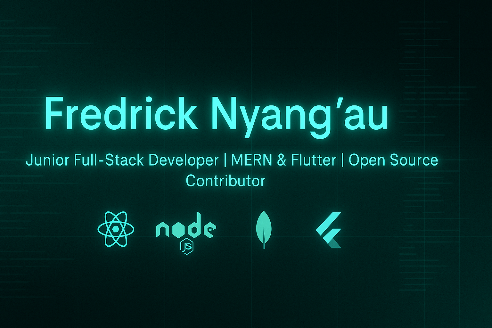

  

  

<h1 align="center">
  Let's Connect and Build Something Amazing! 🚀
</h1>

  
  
  
  
  

---

## 👨‍💻 About Me

I'm **Fredrick Nyang’au**, a **Junior Full-Stack Developer** with 4+ years of experience building web and mobile solutions. I specialize in the **MERN stack** and also develop cross-platform apps using **Flutter**. Passionate about clean UI/UX, performance, and developer experience. I love working on real-world solutions, collaborating with teams, and contributing to open source.

---

## 🛠️ Tech Stack

**Languages & Tools**  

**Frontend**  

**Backend**  

**Databases & Auth**  

**Mobile**  

**Tools**  

---

## 💼 Projects

### 🎵 [Afrisound – Music Education Platform](https://music-edu.vercel.app/)
A web app that archives traditional African musical instruments.

**Tech Used:** React, Node.js, MongoDB, Express.js

---

### 🌐 [Personal Portfolio](https://fredricknyangau.vercel.app/)
Modern portfolio with dark mode, smooth animations, and responsive layout.

---

## 📈 GitHub Stats

  
  

---

  

