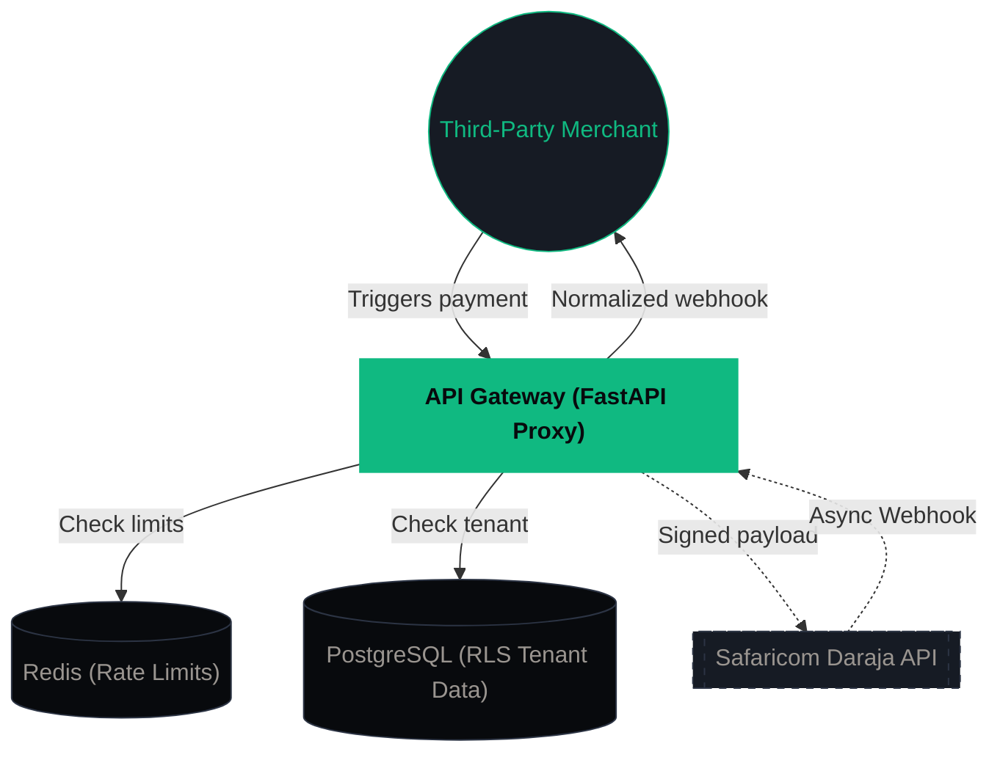

  

  

    
    
    
  

---

### 👨‍💻 About Me

Backend engineer based in **Kenya**, focused on the infrastructure layer that makes East Africa's mobile economy work — payments, data, and APIs that handle real-world conditions like unreliable connections and M-Pesa callbacks. 

I hold a BSc in Information Technology from **Kabarak University** and I am currently the **Founder & Team Lead at Backend Engineers 2026 Community**, where I lead a small engineering team through a structured backend roadmap: FastAPI, PostgreSQL, and system design.

- 🔭 Focusing on **High-performance API systems, System Design, and Data Modeling**
- 📝 I write about what I build and review what I commit. **One commit every day, no exceptions.**
- ⚡ Stack: **Python, FastAPI, PostgreSQL, Docker, Nginx (Ubuntu 24.04 LTS)**

---

### 🧠 Architecture & Engineering Philosophy

Building reliable and scalable systems is primary. My engineering philosophy revolves around:
- **Resilient Architectures**: Embracing stateless services, database-level constraints (to guarantee data integrity), and deterministic error handling.
- **Defensive Design**: Guarding against unexpected payloads, unreliable external webhooks (e.g., Safaricom Daraja), and gracefully recovering through exponential backoffs.
- **Production Culture**: Multi-stage Docker builds, strict PEP 8 type-checking, comprehensive Git workflows, and containerized CI/CD pipelines.

---

### 🛠️ Technical Stack

  

---

### 🚀 Selected Projects

| Project | Description | Tech Stack | Links |
| :--- | :--- | :--- | :--- |
| **[Kukufiti Broiler Management](https://github.com/fredricknyangau/broiler_management_app_backend)** | Robust backend system engineered for broiler farmers to track FCR and mortality rates. Features strict data integrity with DB constraints and sub-30ms aggregations. | `Python` `FastAPI` `PostgreSQL` | [🔴 Live](https://kukufiti.vercel.app/) \| [📂 GitHub](https://github.com/fredricknyangau/broiler_management_app_backend) |
| **[Mobile Money Gateway](https://github.com/fredricknyangau/mmgateway)** | Multi-tenant proxy layer for Safaricom Daraja integrations, normalizing error codes and ensuring webhook delivery with exponential backoff and Redis rate-limiting. | `FastAPI` `PostgreSQL` `Redis` `Docker` | [📂 GitHub](https://github.com/fredricknyangau/mmgateway) |
| **[Wi-Fi Billing & MikroTik Integration](https://github.com/fredricknyangau/wifi-billing)** | Production-grade REST API integrating directly with MikroTik RouterOS for automated voucher generation and session control. | `FastAPI` `PostgreSQL` `MikroTik API` | [📂 GitHub](https://github.com/fredricknyangau/wifi-billing) |

---

### 🏗️ System Architecture Showcase

*Examining the architecture of the Mobile Money Gateway: handling Safaricom Daraja webhooks with Redis rate limiting and PostgreSQL Row-Level Security isolation.*

```mermaid
flowchart TD
  %% Styles
  classDef user fill:#161B24,stroke:#10b981,stroke-width:1px,color:#10b981
  classDef sys fill:#10b981,stroke:#10b981,stroke-width:1px,color:#080A0D,font-weight:bold
  classDef cache fill:#080A0D,stroke:#2C3444,stroke-width:1px,color:#9A9590
  classDef db fill:#080A0D,stroke:#2C3444,stroke-width:1px,color:#9A9590
  classDef ext fill:#161B24,stroke:#2C3444,stroke-width:1px,stroke-dasharray: 5 5,color:#9A9590

  Merchant((Third-Party Merchant)):::user
  GW["API Gateway (FastAPI Proxy)"]:::sys
  Redis[("Redis (Rate Limits)")]:::cache
  DB[("PostgreSQL (RLS Tenant Data)")]:::db
  Safaricom[["Safaricom Daraja API"]]:::ext
  
  Merchant -->|Triggers payment| GW
  GW -->|Check limits| Redis
  GW -->|Check tenant| DB
  GW -.->|Signed payload| Safaricom
  Safaricom -.->|Async Webhook| GW
  GW -->|Normalized webhook| Merchant
```

---

### 📈 Career Timeline

- **Jan 2026 – present:** Founder & Team Lead @ *Backend Engineers 2026 Community*
- **Jan 2025 – Apr 2025:** ICT Intern @ *Public Service Office, Kenya*
- **Sep 2021 – Dec 2025:** BSc Information Technology @ *Kabarak University, Nakuru*

---

### 📝 Latest Articles

<!-- BLOG-POST-LIST:START -->
<!-- BLOG-POST-LIST:END -->

---

### 📊 GitHub Statistics

  
    
  
  

  <picture>
    <source media="(prefers-color-scheme: dark)" srcset="https://raw.githubusercontent.com/fredricknyangau/fredricknyangau/output/github-contribution-grid-snake-dark.svg">
    <source media="(prefers-color-scheme: light)" srcset="https://raw.githubusercontent.com/fredricknyangau/fredricknyangau/output/github-contribution-grid-snake.svg">
    
  </picture>

  

