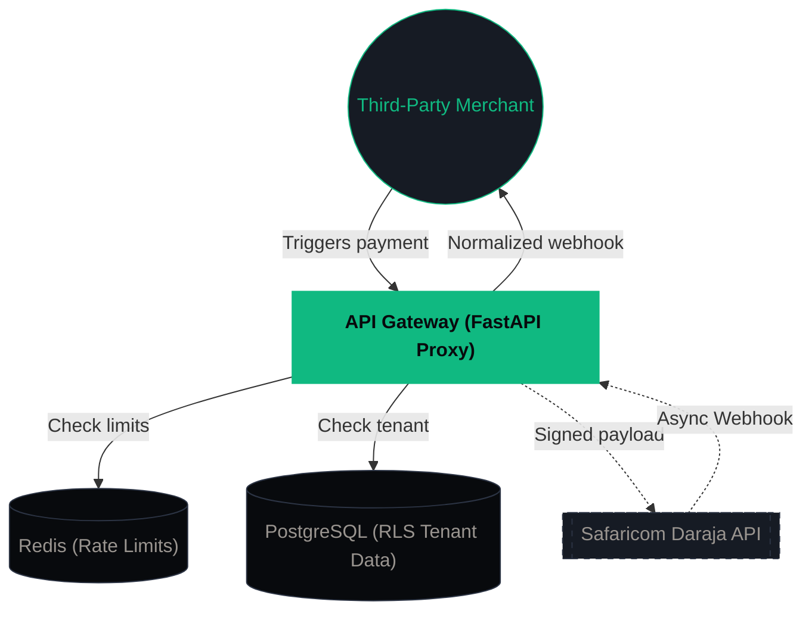

  

  

    
    
    
  

---

### 👨‍💻 About Me

Junior Backend Engineer based in **Nairobi, Kenya**, focused on building secure, well-structured APIs for the East African market — payments, farm management, and billing systems that handle M-Pesa callbacks, real-world data conditions, and production constraints.

I hold a BSc in Information Technology from **Kabarak University** and currently serve as **Founder and Team Lead at Backend Engineers 2026**, where I lead a structured engineering team through a backend roadmap covering FastAPI, PostgreSQL, and system design.

- 🔭 Currently building **KukuFiti** — a live agritech API for broiler farm management, deployed on Render
- 📝 I write about what I build and review what I commit. **One commit every day, no exceptions.**
- 🌍 Open to **Junior Backend Engineering roles** in Nairobi, remote-first teams, and backend freelance contracts — especially in Fintech and Agritech
- ⚡ Stack: **Python, FastAPI, PostgreSQL, asyncpg, Docker, Nginx (Ubuntu 24.04 LTS)**

---

### 🧠 Engineering Philosophy

- **Database first**: Design the schema before writing a single route. Data integrity is not optional.
- **Failure modes early**: Guard against unexpected payloads, unreliable webhooks, and external API timeouts before they reach production.
- **Raw SQL where it matters**: asyncpg over ORM on performance-critical paths for full query control.
- **Reproducible deployments**: Numbered SQL migrations, environment-based config, and containerized builds — no manual steps on the server.

---

### 🛠️ Technical Stack

  

---

### 🚀 Projects

| Project | Description | Stack | Links |
| :--- | :--- | :--- | :--- |
| **[KukuFiti — Broiler Farm API](https://github.com/fredricknyangau/broiler_management_app_backend)** | Production FastAPI backend for poultry farm management. Tracks flock health, feed cycles, mortality events, and KES/M-Pesa finances. Modular monolith with schema-per-module PostgreSQL isolation and numbered SQL migrations. | `Python` `FastAPI` `asyncpg` `PostgreSQL 16` `Docker` | [🟢 Live API](https://kukufiti.vercel.app/) \| [📂 GitHub](https://github.com/fredricknyangau/broiler_management_app_backend) |
| **[Mobile Money Gateway](https://github.com/fredricknyangau/mmgateway)** | Multi-tenant proxy layer for Safaricom Daraja integrations. Normalizes error codes, handles webhook delivery with exponential backoff, and enforces per-tenant rate limiting via Redis. | `FastAPI` `PostgreSQL` `Redis` `Docker` | [📂 GitHub](https://github.com/fredricknyangau/mmgateway) |
| **[WiFi Billing System](https://github.com/fredricknyangau/wifi-billing)** | ISP billing API with OAuth2 scopes, RBAC authorization, and M-Pesa Daraja payment flows. Integrates with MikroTik RouterOS for automated voucher generation and session control. | `FastAPI` `PostgreSQL` `MikroTik API` | [📂 GitHub](https://github.com/fredricknyangau/wifi-billing) |

---

### 🏗️ System Architecture — Mobile Money Gateway

_Multi-tenant Daraja webhook handling with Redis rate limiting and PostgreSQL Row-Level Security isolation._

```mermaid
flowchart TD
  classDef user fill:#161B24,stroke:#10b981,stroke-width:1px,color:#10b981
  classDef sys fill:#10b981,stroke:#10b981,stroke-width:1px,color:#080A0D,font-weight:bold
  classDef cache fill:#080A0D,stroke:#2C3444,stroke-width:1px,color:#9A9590
  classDef db fill:#080A0D,stroke:#2C3444,stroke-width:1px,color:#9A9590
  classDef ext fill:#161B24,stroke:#2C3444,stroke-width:1px,stroke-dasharray: 5 5,color:#9A9590

  Merchant((Third-Party Merchant)):::user
  GW["API Gateway (FastAPI Proxy)"]:::sys
  Redis[("Redis (Rate Limits)")]:::cache
  DB[("PostgreSQL (RLS Tenant Data)")]:::db
  Safaricom[["Safaricom Daraja API"]]:::ext

  Merchant -->|Triggers payment| GW
  GW -->|Check limits| Redis
  GW -->|Check tenant| DB
  GW -.->|Signed payload| Safaricom
  Safaricom -.->|Async Webhook| GW
  GW -->|Normalized webhook| Merchant
```

---

### 📈 Career Timeline

| Period | Role |
| :--- | :--- |
| **Jan 2026 – Present** | Founder and Team Lead, Backend Engineers 2026 Community |
| **Jan 2025 – Apr 2025** | ICT Intern, Huduma Centre Nakuru (Kenya) |
| **Sep 2021 – Dec 2025** | BSc Information Technology, Kabarak University |

---

### 📝 Writing

<!-- BLOG-POST-LIST:START -->
- [Modular Monolith Backend Systems](https://dev.to/fredricknyangau/modular-monolith-backend-systems-479l)
<!-- BLOG-POST-LIST:END -->

---

### 📊 GitHub Stats

  
    
  
  

  <picture>
    <source media="(prefers-color-scheme: dark)" srcset="https://raw.githubusercontent.com/fredricknyangau/fredricknyangau/output/github-contribution-grid-snake-dark.svg">
    <source media="(prefers-color-scheme: light)" srcset="https://raw.githubusercontent.com/fredricknyangau/fredricknyangau/output/github-contribution-grid-snake.svg">
    
  </picture>

  

